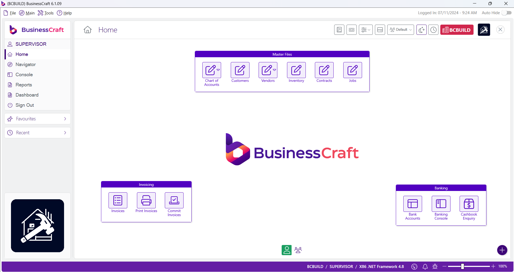
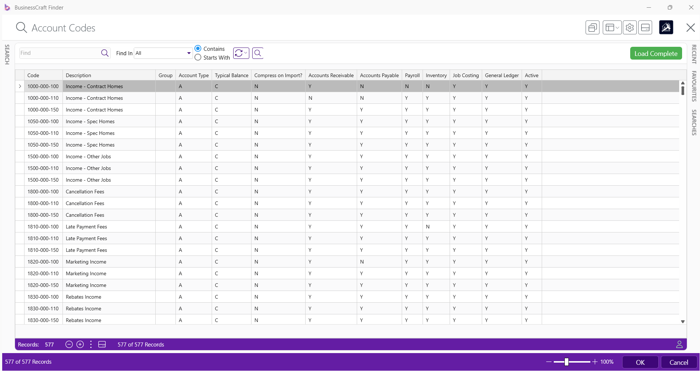
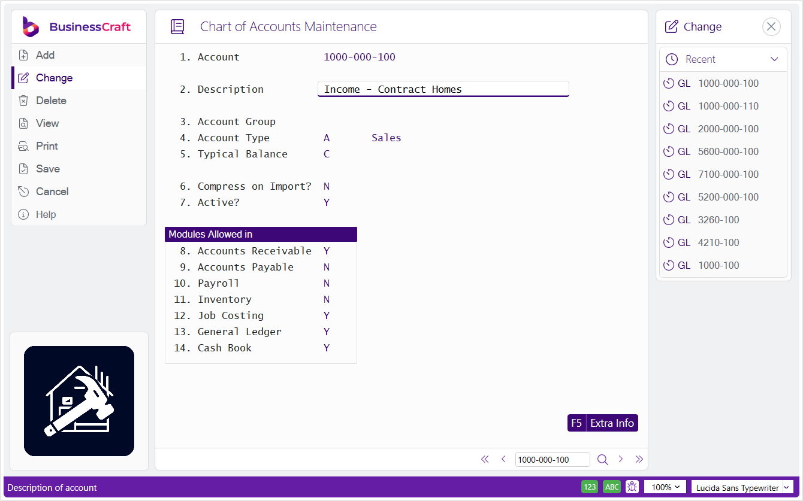
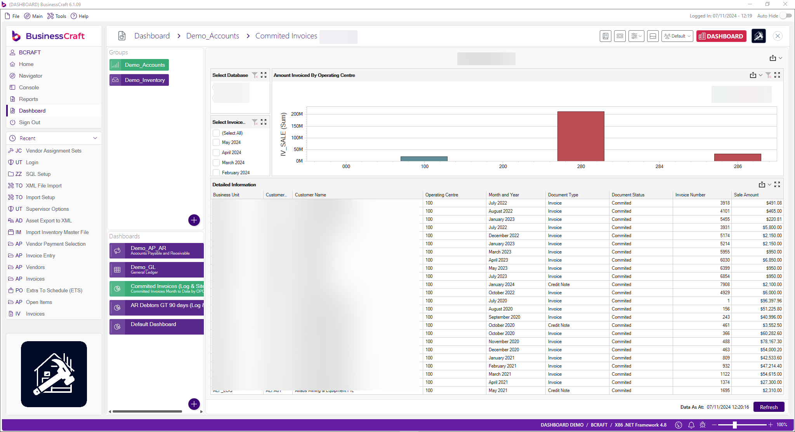
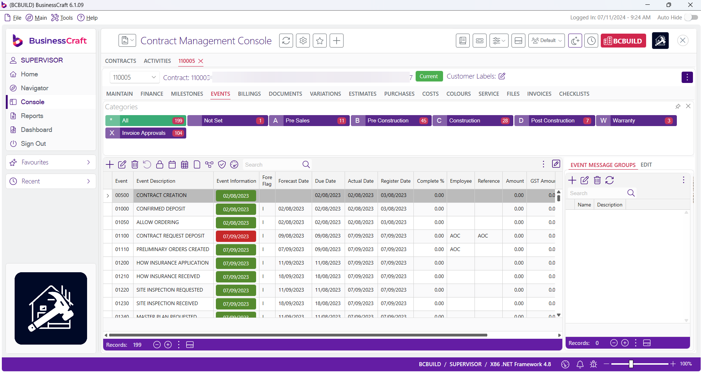

# BusinessCraft Overview

BusinessCraft is an Australian developed software solution designed for the industry specifi­c needs of the Residential Building, Engineering, Manufacturing and Construction industries. With over 30 years of experience, BusinessCraft Software provides a fully integrated system, enabling companies to streamline operations, increase productivity, and provide excellent customer service.

### General Features

| Feature | Description |
| ----------- | ----------- |
| Productivity Increase | Enhance your team efficiency by providing access to information they require quickly and easily. |
| Maximise Return on Investment | Ease of use, flexibility and scalability streamlines operations and delivers superior customer service. |
| Make Decisions with Ease and Con­fidence | Accurate enquiries, reporting and dashboards enable monitoring of business operations, control of costs, and sound financial management. |
| True Integration | Assurance that an integrated solution meets entire business needs without cumbersome interfaces or data import/export. |

### Residential Building and Construction Features

| Feature | Description |
| ----------- | ----------- |
| Job Tracking | Utilise BusinessCraft events to not only know where every job is up to, but compare the baseline date to the calculated forecast or the actual completion date to understand where you have project slack. |
| Extra to Schedule | Track where ALL extra to schedule (or margin erosion) costs are incurred, with the ability to record the reason, person responsible and extra comments for flexible reporting. This is controlled within both Purchasing and Accounts Payable. |
| Effi­cient Ordering | Utilise email for the distribution of Purchase Orders, and optionally attach required drawings or other documentation to reduce ordering overheads. |
| Compare Standard Bill of Materials | Produce cost comparison reports to compare up to 20 standard bills or assemblies on a single page to review costings. Let BusinessCraft calculate a recommended sale price based on a standard margin to automatically update your price book. |
| Manage Colour Selections | Track all colour selections and manage in conjunction with job progress. Automatically modify the production estimate and print on Purchase Orders, ensuring no selections are overlooked. |

### Engineering and Manufacturing Features

| Feature | Description |
| ----------- | ----------- |
| Job Costing | Use Business Craft’s fully integrated and powerful Job Costing capabilities to keep track of job progress and costs in real time. |
| Payroll | Use BusinessCraft’s fully integrated and legislative compliant Payroll module to process timesheets records and payroll efficiently for all types of payrolls. |
| Effi­cient Ordering | Use Requisitions and Purchasing to purchase direct to job, to stock or to general ledger account with full 3-way match integration to Accounts Payable. Have Purchase Orders emailed direct to suppliers in background to reduce ordering overheads. |
| Manage Inventory | Use BusinessCraft’s Inventory Module and optionally Bills of Materials to manage inventory across multiple locations with tracking of on hand, on order and allocated. Optionally use reorder point for replenishment, either physical stocktaking or cycle counts and serial tracking with integration to Warranty Tracking if required. |
| Make to Stock or Make to Order | Use BusinessCraft’s Order Entry module optionally with back order capability in conjunction with Shop Floor Control to handle Make to Stock or Make to Order manufacturing requirements. |

## Navigation

### Home

The Home Page displays when logging in to BusinessCraft.

- Collapsible Menu Sidebar with links to Dashboards, Navigator, Reports and Consoles
- Collapsible Favourites and Recent Panels
- A Desktop Area for user defined shortcuts to frequently used screens
- A Status Bar with Logged in User, Company, Notifications and Zoom Slider

### Finder

The Finder is used to look up records quickly and easily in BusinessCraft:

Key features include:
- Fast initial search results
- Customisable search settings
- Customisable grid for search results
- Feature rich Search Panel
- Saved Searches
- Favourite Searches
- Recent Searches
- Dock/Floating or Auto-Hide Panels
- Auto Load, Search Limit and Clear options

### Screens

BusinessCraft screens provide an intuitive interface including a Menu Sidebar and Recent Panel with field level help:

## Key Performance Indicators

### Dashboards

Customer definable dashboards provide quick access to key performance metrics:

### Consoles

Consoles provide process flow screens to minimise menu navigation:

## Financials

### General Ledger

The General Ledger Module imports financial transactions from other BusinessCraft modules and enables the posting of those transactions, into financial periods as defined by Period Tables, to accounts created in the Chart of Accounts.

The Chart of Accounts is a list of all valid accounts and their descriptions within the General Ledger and includes of variety of settings to control posting of transactions and generating reports. The Chart of Accounts may be structured to address a variety of business requirements and includes the ability to structure accounts into segments and to record budgets for comparison to actual results.

BusinessCraft records each individual transaction in source BusinessCraft modules. These transactions are referred to in BusinessCraft as distributions. Those distributions are imported into the General Ledger in a manner and frequency that suits business requirements.

The General Ledger also provides:
- Advance Period, Close Period and Close Year processing
- General and Standing Journals
- Wide range of Enquiries and Reports
- Intercompany Accounting
- General Ledger Report Writer
- Foreign Currency capability

### Accounts Receivable

The Accounts Receivable Module provides a comprehensive Customer Master file and keeps track of all customer invoice and receipt transactions. A range of enquiries and reports including aged balances provides immediate access to amounts due with supporting details.

Other features include:
- Credit Limits
- Statements – Print or Email
- Dispute Handling
- Foreign Currency
- Splitting Cash Receipts across multiple invoices or unapplied
- Debtor Factoring
- Retention Management
- Reprint Invoices
- Sales Consultants and Budgets
- Commissions

### Accounts Payable

The Accounts Payable Module provides a comprehensive Vendor Master file and keeps track of all supplier and subcontractor invoice and payment transactions. A range of enquiries and reports including aged balances provides immediate access to amounts owing with supporting details.

Other features include:
- Subcontractor Management
- Remittance Advices – Print or Email
- Supplier Back Charges
- Foreign Currency
- Match Invoices to Purchase Orders or post direct to GL or Job
- Prepaid Invoice processing
- Extra to Schedule or Tolerance Controls
- Hold Invoices
- Landed Costing
- Electronic Commerce
- EFT Support including creation of ABA files
- Taxable Payments Reporting with SBR integration
- Supplier Back Charges
- Accounts Payable Scanned Invoice Integration (Residential Building)

### Assets

The Assets Module provides fully integrated asset management capability for Acquisitions, Disposals and Revaluations. Besides providing typical Assets Register functionality, the BusinessCraft Assets module optionally provides source data for the BusinessCraft Equipment Hire, Equipment Register and Service modules. 

Key features include:
- Book and/or Tax Depreciation
- Straight Line, Diminishing and Instant Write Off Depreciation Calculation Methods
- Insurance Valuation
- Extensive asset master to record details of assets
- Asset Allocation capability to keep track of assets (including non-depreciable equipment)
- Range of enquiries and reports for management of assets
- Repair History
- Asset Availability

### Cashbook

The Cashbook Module provides the ability to manage multiple bank accounts including the processing of receipts, payments and transfers either manually in the Cashbook Module or from other source BusinessCraft Modules:
- EFT payments and ABA files
- Bank reconciliation

### Payroll

Unlike many other systems, the Payroll Module is fully integrated to other BusinessCraft modules. BusinessCraft ensures that legislative requirements are met with Compliance Product Updates as needed. 

Key Features include:
- Multiple Payrolls with Weekly, Fortnightly or Monthly Payroll supported
- Wide range of timesheet entry options
- Tax Scales maintained by BusinessCraft automatically
- Single Touch Payroll
- Month and Year End Processing
- Leave Provision Accruals (RDO, PL, AL and LSL)
- Comprehensive Superannuation processing with Super Stream capability
- Termination Payments including ETP
- Payment Summaries and EMPDUPE file processing with SBR integration.
- Awards and Shift Management
- Payroll Rules
- Allowances and Deductions
- Month to Date and Year to Date Tracking of all payroll components
- Warnings, Absences, Probation and Extra Information
- Wide range of enquiries and reports including PAYG and Payroll Tax
- EFT payments and ABA files
- Pay Slips can be printed or emailed
- Document Register

### Invoicing

The Invoicing Module provides a wide range of methods to create invoices enabling customers to select the most suitable techniques appropriate to their business. Within each method are additional options to streamline the creation of invoices leveraging information already recorded in other BusinessCraft modules:
- Invoices by Customer, Job or Contract
- Contract Progress Billing and/or Job Progress Claims
- Generate Invoices from Contracts (Progress Billing), Jobs and/or Orders,
- Generate Standing Invoices, from Service Dockets, Payroll Billing or Supplier Rebates
- Generate Invoices for Hire Jobs.
- Automatic, Partial or Manual Cost Take-Ups. Optionally, Hold Costs from Job Invoices
- Debit/Credit Notes
- Retentions
- Invoices can be printed or emailed
- Document Register

### Business Activity

The Business Activity Module collects GST related information on transactions processed in BusinessCraft including the GST and GST Exclusive components of the transaction. The GST paid on supplies and collected on acquisitions can be reviewed using menu selections in Enquiries and Reports

The Business Activity Statement summarises transactions by BAS Groups (which are linked to user defined GST Rates) to satisfy the reporting requirements of the Australian Taxation Office.

