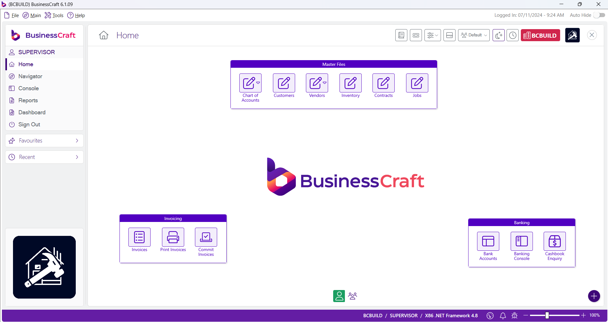
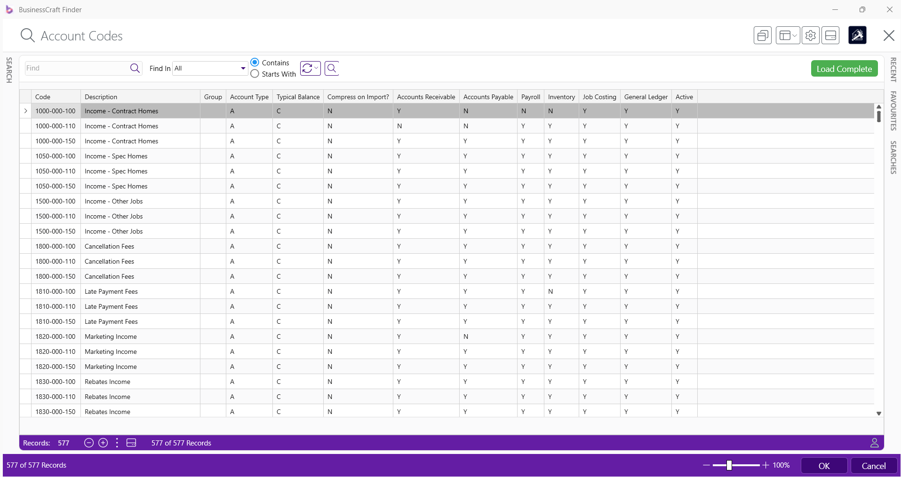
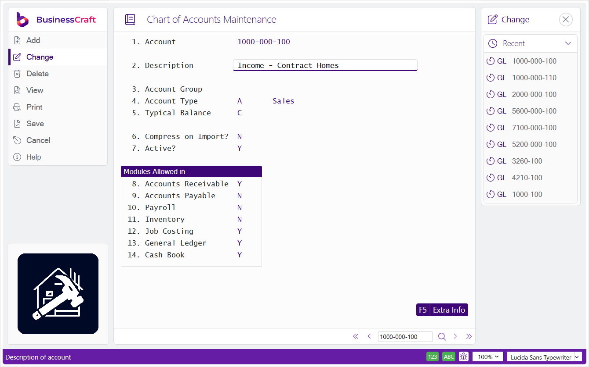
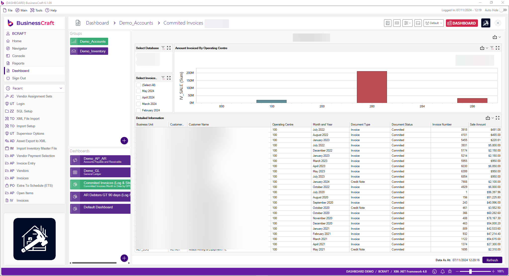
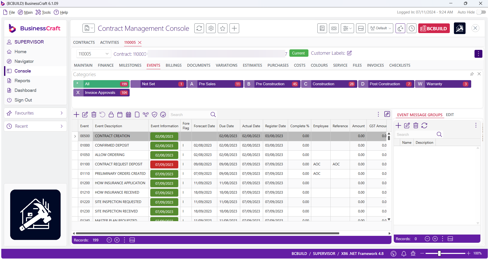

# Overview

BusinessCraft is an Australian developed software solution designed for the industry specifi­c needs of the Residential Building, Engineering, Manufacturing and Construction industries. With over 30 years of experience, BusinessCraft Software provides a fully integrated system, enabling companies to streamline operations, increase productivity, and provide excellent customer service.

## General Features

| Feature | Description |
| ----------- | ----------- |
| Productivity Increase | Enhance your team efficiency by providing access to information they require quickly and easily. |
| Maximise Return on Investment | Ease of use, flexibility and scalability streamlines operations and delivers superior customer service. |
| Make Decisions with Ease and Con­fidence | Accurate enquiries, reporting and dashboards enable monitoring of business operations, control of costs, and sound financial management. |
| True Integration | Assurance that an integrated solution meets entire business needs without cumbersome interfaces or data import/export. |

## Residential Building and Construction Features

| Feature | Description |
| ----------- | ----------- |
| Job Tracking | Utilise BusinessCraft events to not only know where every job is up to, but compare the baseline date to the calculated forecast or the actual completion date to understand where you have project slack. |
| Extra to Schedule | Track where ALL extra to schedule (or margin erosion) costs are incurred, with the ability to record the reason, person responsible and extra comments for flexible reporting. This is controlled within both Purchasing and Accounts Payable. |
| Effi­cient Ordering | Utilise email for the distribution of Purchase Orders, and optionally attach required drawings or other documentation to reduce ordering overheads. |
| Compare Standard Bill of Materials | Produce cost comparison reports to compare up to 20 standard bills or assemblies on a single page to review costings. Let BusinessCraft calculate a recommended sale price based on a standard margin to automatically update your price book. |
| Manage Colour Selections | Track all colour selections and manage in conjunction with job progress. Automatically modify the production estimate and print on Purchase Orders, ensuring no selections are overlooked. |

## Engineering and Manufacturing Features

| Feature | Description |
| ----------- | ----------- |
| Job Costing | Use Business Craft’s fully integrated and powerful Job Costing capabilities to keep track of job progress and costs in real time. |
| Payroll | Use BusinessCraft’s fully integrated and legislative compliant Payroll module to process timesheets records and payroll efficiently for all types of payrolls. |
| Effi­cient Ordering | Use Requisitions and Purchasing to purchase direct to job, to stock or to general ledger account with full 3-way match integration to Accounts Payable. Have Purchase Orders emailed direct to suppliers in background to reduce ordering overheads. |
| Manage Inventory | Use BusinessCraft’s Inventory Module and optionally Bills of Materials to manage inventory across multiple locations with tracking of on hand, on order and allocated. Optionally use reorder point for replenishment, either physical stocktaking or cycle counts and serial tracking with integration to Warranty Tracking if required. |
| Make to Stock or Make to Order | Use BusinessCraft’s Order Entry module optionally with back order capability in conjunction with Shop Floor Control to handle Make to Stock or Make to Order manufacturing requirements. |

---

## Navigation

### Home

The Home Page displays when logging in to BusinessCraft.

- Collapsible Menu Sidebar with links to Dashboards, Navigator, Reports and Consoles
- Collapsible Favourites and Recent Panels
- A Desktop Area for user defined shortcuts to frequently used screens
- A Status Bar with Logged in User, Company, Notifications and Zoom Slider

### Finder

The Finder is used to look up records quickly and easily in BusinessCraft:

Key features include:
- Fast initial search results
- Customisable search settings
- Customisable grid for search results
- Feature rich Search Panel
- Saved Searches
- Favourite Searches
- Recent Searches
- Dock/Floating or Auto-Hide Panels
- Auto Load, Search Limit and Clear options

### Screens

BusinessCraft screens provide an intuitive interface including a Menu Sidebar and Recent Panel with field level help:

---

## Key Performance Indicators

### Dashboards

Customer definable dashboards provide quick access to key performance metrics:

### Consoles

Consoles provide process flow screens to minimise menu navigation:

