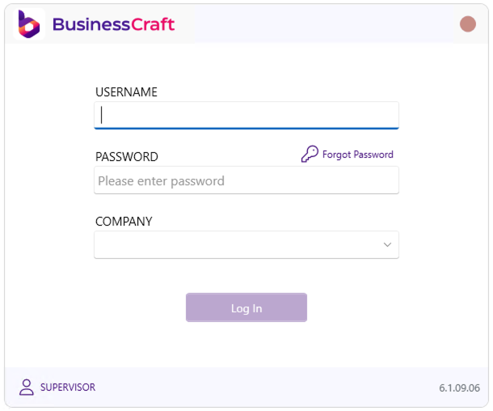

# BC Homes Scenario

BC Homes is a newly formed company specialising in the construction of project homes. The company is owned by Bill Carpenter who is a qualified building tradesperson and has left his former employment to commence his own business.

Whilst only a newly started business, Bill decided to establish sound processes from the outset. He has implemented BusinessCraft to control not only the estimating, purchasing and construction aspects of his projects but to also manage the accounting functions of his business to ensure the success of the business.

Bill has put his architectural skills into action and has designed his first standard model home, which will form the basis of the BC Homes designer range. Due to its suitability for the regional environment he has appropriately named this model the `WOODSTOCK`. Whilst it is Bill’s intention to construct two `WOODSTOCK` display homes to attract customers, the design team are also developing a future model called the `MONTEREY`.

In conjunction with members of the BusinessCraft team, the BusinessCraft software was installed and implemented in accordance with Bill’s business requirements:
- Each module to be used by BC Homes was configured to suit Bill’s operations
- Documents and reports were customised (e.g. Invoices, Purchase Orders etc.)
- Process Flow Testing was carried out
- User Procedures were written and users trained
- Existing required BC Homes data was converted over to BusinessCraft
- BC Homes went live with BusinessCraft

Bill has made his first sale to Mr & Mrs Watts who are retiring and wish to invest in a new home.

Working through the remainder of this process guide will illustrate how Bill uses BusinessCraft to control both the construction of his first Woodstock project as well as his business.

## Logging into BusinessCraft

Click on the BusinessCraft icon on the desktop to log in to BusinessCraft and the BusinessCraft login screen will be displayed:

Enter your username and password or in the case of prospective customers enter the username and password provided to you and tab to the Company field. If you have entered a valid username and password, green ticks will appear against both fields:

At the Company field type `BCHOMES` or select that dataset from the drop-down list and then click the Log In button.

Provided your login is authorised to access the dataset, the BusinessCraft Desktop will be displayed:

For more details on the BusinessCraft Desktop and navigating in BusinessCraft please refer to the [Navigation](/docs/getting-started/overview/#navigation) section 